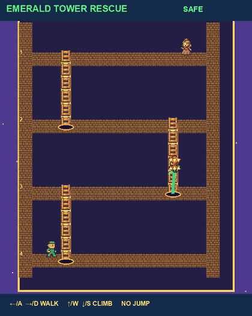
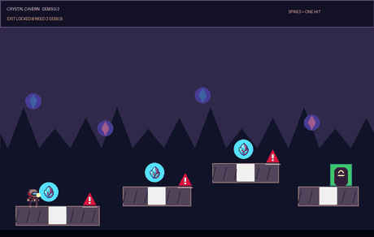
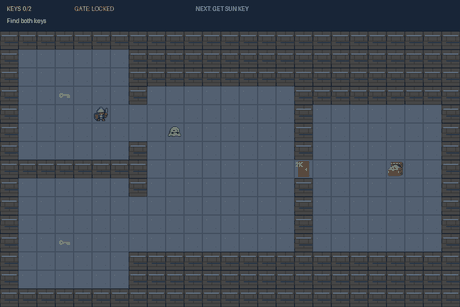
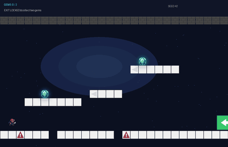
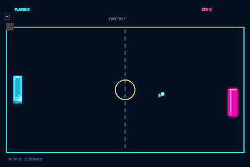
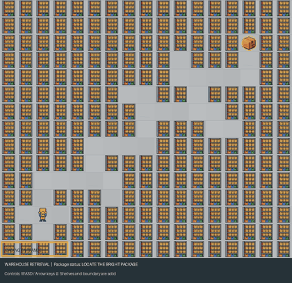

# InfiniEnv

**Infinite environment generation via an agent harness.** Type a world in plain English; an agent
builds it in real game code, a layered harness verifies it, and a **separate pixel-policy must
actually beat the game** before the run may claim success.

> An agent builds. The harness verifies. A player other than the author must win.

<p align="center">
  
  
</p>
<p align="center"><em>Both worlds above were built, coded, illustrated, played, and verified end-to-end by the harness from one sentence each.</em></p>

The bet, straight from the challenge brief: **code-defined objectives beat a VLM checking pixels.**
Generation is open-ended — the agent writes each game's actual code, so there's no fixed-vocabulary
ceiling on mechanics — but *success is always decided by code and independent checks*, never by the
generating model's say-so and never by a VLM eyeballing pixels. Every `generate` run must clear
four verification layers: **deterministic geometry validation** → **artifact & motion sanity
floors** → an **independent faithfulness audit** (a second LLM reads the code as text against a
derived requirements checklist) → the **played-through proof** (an external vision policy, seeing
only rendered frames, plays the game through its `make_env()` interface and must *win* — judged by
the game's own code). A failed layer feeds concrete evidence back to the same agent for repair.

## Showcase

| World (one-sentence prompt) | Replay | Verdict |
|---|---|---|
| *"A knight explores a small dungeon: collect two keys to unlock the treasure gate, avoid the patrolling slime, and reach the treasure"* |  | ✅ **the full stack, live**: geometry-validated · audit caught (then fixed) a real collision exploit · **beaten by the external vision policy** — this GIF *is* the policy's winning playthrough (58 actions, win judged by the game's own code) |
| *"An Italian man in green rescues a princess from a tower, avoiding the plants that try to eat him"* |  | ✅ built · **independently audited** — real generated sprites |
| *"A 2D side-view cave platformer: jump uneven ledges and gaps, dodge spikes, collect two crystals, reach the door"* |  | ✅ built · **independently audited** — real generated sprites + HUD |
| *"A procedurally generated cave with uneven terrain, spike hazards, and glowing gems — collect two to unlock the exit"* |  | ✅ built · **independently audited** — layout generated from the seed |
| *"Create a game of pong against a cpu"* |  | ✅ built · **independently audited** |
| *"A warehouse where shelves nearly block the package — exactly one valid path"* |  | ✅ built · **independently audited** |

The harness reports what actually happened, not what the model claims — a run only earns a ✅ once
independent checks (and, for the dungeon, an external player) agree.

## Results (live API, committed summaries)

- **The full verification stack, live** (`runs/showcase_dungeon4`): one prompt → the agent built
  the dungeon; the independent audit caught a real exploit (the knight could tunnel through the
  slime when they swapped cells in one tick) and forced a fix; then the external vision policy
  **beat the finished game in 58 actions** — `metrics.json` records all four verdicts, and the
  committed GIF above is the policy's own winning episode. The same gate also *honestly failed* an
  earlier run no external player could beat (`success: false` despite the agent's self-reported
  success) — the gate is real in both directions.
- **Real-LLM benchmark** (`benchmark examples/prompts.txt --provider openai_agents`, 8 prompts):
  **7/8 valid + solved on the first try, zero repairs; 8/8 solved overall** (the one maze failure
  exhausted its repair budget and fell back to the deterministic template — recorded honestly in
  `benchmark_summary.json`, never hidden). Avg generation 10.0 s, avg solution path 20 actions.
- **Dataset export**: `export-dataset` over 28 executed runs (2 curricula + 10 validated mutations
  + the 8 live-LLM benchmark worlds) → `dataset.jsonl` with a **per-goal `programmatic_reward`**
  per row — the code-truth signal the brief wants reward models trained on.
- **Vision-policy episodes** (`navigate`, 10 live episodes across 5 worlds): **8/10 solved by the
  pixel-only policy**, success judged by `is_goal_complete` over game state — never by pixels.
  Every episode also records `vlm_judge_success` (a naive VLM reading the final frame) beside the
  code truth for contrast. The two honest failures are both the push-physics world — the stand-in
  policy never discovers shove-by-walking, exactly the kind of gap a trained policy (the brief's)
  would close.
- **474+ passing tests** (`pytest`, hermetic — no keys needed).

## Quickstart

### 0. The zero-key demo (no account, no network)

```bash
pip install -e ".[gui]"
python -m infinienv demo
```

Solves three committed example worlds end to end (plan → execute → render → animated replay), then
opens the GUI: browse the gallery, and drive any world yourself with the keyboard in **Play** mode.

### 1. Full setup (generation + playthrough)

```bash
pip install -e ".[gui,claude,openai]"
python -m infinienv setup        # guided: saves keys to .env + prints a readiness checklist
```

You need an **`OPENAI_API_KEY`** (prompt refinement, the audit, sprite generation, the vision
policy). The sandbox agent itself runs on the **Claude Agent SDK** by default and authenticates
through the `claude` CLI — if the readiness check flags it:

```bash
npm install -g @anthropic-ai/claude-code   # skip if you already have `claude`
claude login
```

### 2. Generate a world

```bash
python -m infinienv gui          # opens http://127.0.0.1:5050
```

Type a prompt, hit **Compile world**, and watch the agent work live — its decisions, commands, code
edits, generated sprites, the audit verdict, and finally the external policy playing (and beating)
the world. Or from the CLI:

```bash
python -m infinienv generate --prompt "a knight collects two keys to unlock the treasure gate, avoiding a slime" --seed 11 --out runs/dungeon
```

## The reviewer's 10-minute tour

1. `python -m infinienv demo` — zero-key: solved worlds + the GUI gallery + keyboard Play mode.
2. `python -m infinienv gui` → **Compile world** with any prompt — watch the build, the audit, and
   the played-through proof live (needs keys, ~5–15 min).
3. `python -m infinienv navigate examples/vision_demo.json --out runs/vis` — the brief's exact
   loop: a pixel-only policy plays, code decides success, and a naive VLM-on-pixels verdict is
   recorded beside it for contrast.

## How the challenge criteria map

| Criterion | Where it's answered |
|---|---|
| **Creativity** | Agent-authored game code (no fixed mechanic ceiling) + generated pixel-art sprites + mutation/curriculum/dataset tooling + a Gymnasium-style pixel-obs env any frame-in/action-out policy can drop into. |
| **Clarity** | This README → [How it works](docs/overview.md) (10 min) → [CLI reference](docs/cli.md). The GUI streams every step live; `metrics.json` records every verdict per run. |
| **Working output** | The demo runs with zero keys; 474+ hermetic tests; committed example world + committed results summaries; `metrics.json` never overclaims — a world only counts once a player other than its author has beaten it. |

## Learn more

- **[How it works](docs/overview.md)** — the pipeline, the four verification layers, the
  vision-policy loop, and the evaluation-criteria mapping.
- **[CLI reference](docs/cli.md)** — every command, artifacts, extended mechanics, physics, assets,
  and the mutation / curriculum / dataset tools.
- **[Deploying it](docs/deploy.md)** — hosting the GUI on a persistent server.
- **[CLAUDE.md](CLAUDE.md)** — the full design doc and the non-negotiable invariants.
- **[notes.md](notes.md)** — the running decision / bug log from the build.
